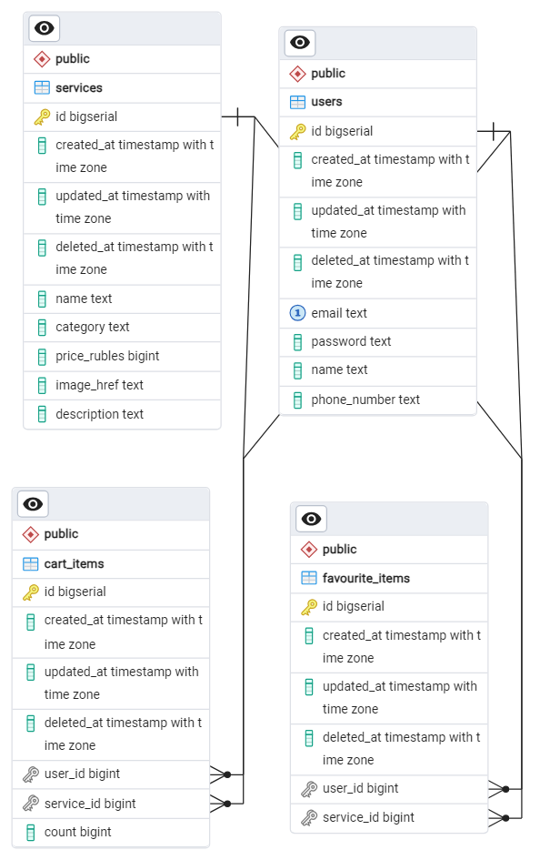
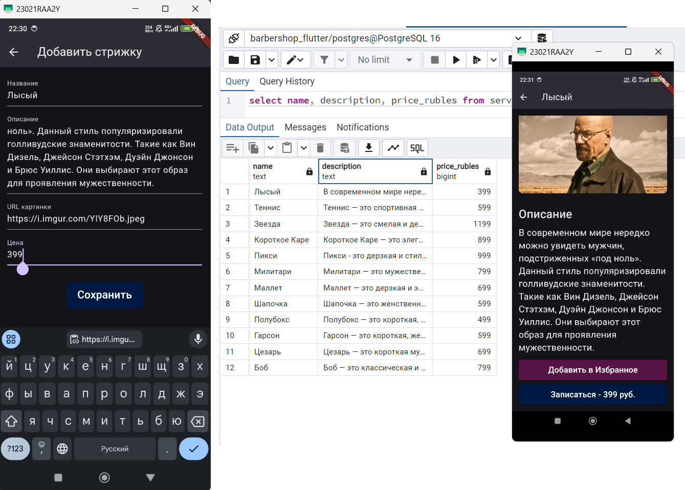
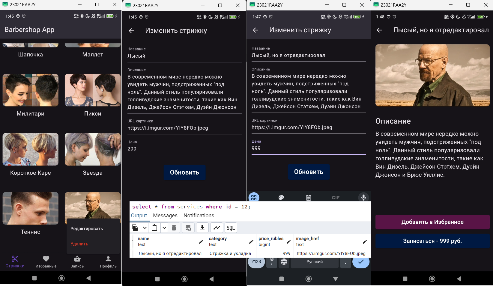
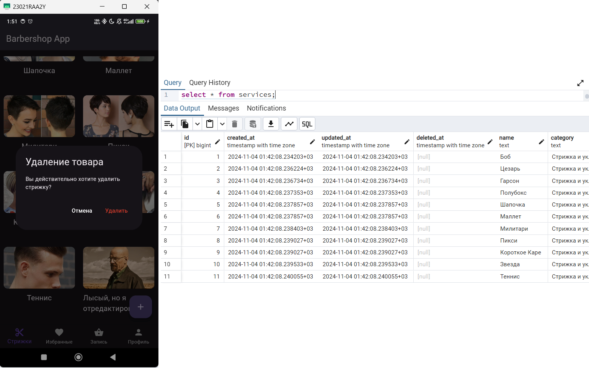

# Практика 9 Столяров ЭФБО-01-22 22T0318

## Задание.
В дополнение к предыдущей практике реализовать API добавления, удаления, редактирования, просмотра товара.

## Решение
API добавления товара уже реализовано в  <a href="https://github.com/DaniilStolyarov/pks_sem5_p8">предыдущей практике.</a>
Напомню, что данные хранятся в БД, бекенд использует GORM для взаимодействия с ней.

Таблицы, которые уже используются в БД:

<ul>
    <li>users (id, email, password, name, phone_number)</li>
    <li>services(id, name, category, price_rubles, image_href, description)</li>
    <li>favourite_items(id, user_id, service_id)</li>
    <li>cart_items(id, user_id, service_id, count)</li>
</ul>
Добавление новых таблиц не требуется.

Реализуем дополнительное REST API:
<ul>
    <li>DELETE /service?id={...} - удаляет услугу по её id</li>
    <li>PUT /service?id={...} - отправляет новые JSON-данные услуги</li>
    <li>GET /service?id={...} - возвращает стрижку</li>
</ul>

## Ход выполнения
### Шаг 1. Создание API на Go

Весь API описан в файле <a href="./backend/backend.go">backend.go</a> и протестирован с помощью <a href="https://elements.getpostman.com/redirect?entityId=24015280-8a099f19-cf00-4125-9654-e3b574800df0&entityType=collection">Postman</a>

### Шаг 2. Отправка запросов с клиента
По удержании пальца на карточке товара появляется контекстное меню (см. Скриншоты) с двумя опциями: Редактировать, Удалить. При нажатии на кнопку "Редактировать" открывается окно с редактированием, где на полях находятся текущие значения. Они подгружаются одним GET-запросом.

При нажатии на кнопку "Удалить" возникает предупреждение, затем происходит удаление с помощью DELETE-запроса.

Весь остальной функционал уже есть в <a href="https://github.com/DaniilStolyarov/pks_sem5_p8">предыдущей практике.</a>
## Скриншоты
### Диаграмма БД

### Добавить стрижку

### Редактировать стрижку

### Удалить стрижку

